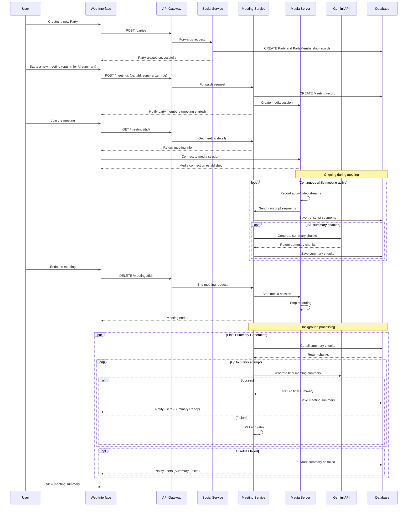

# Social Learning & Party Collaboration Flow

```mermaid
sequenceDiagram
    participant U as User
    participant UI as Web Interface
    participant APIGateway as API Gateway
    participant SocialService as Social Service
    participant MeetingService as Meeting Service
    participant MediaServer as Media Server
    participant Gemini as Gemini API
    participant Database as Database

    %% Party Creation
    U->>UI: Creates a new Party
    UI->>APIGateway: POST /parties
    APIGateway->>SocialService: Forwards request
    SocialService->>Database: CREATE Party and PartyMembership records
    SocialService-->>UI: Party created successfully

    %% Meeting Creation
    U->>UI: Starts a new meeting (opts-in for AI summary)
    UI->>APIGateway: POST /meetings (partyId, summarize: true)
    APIGateway->>MeetingService: Forwards request
    MeetingService->>Database: CREATE Meeting record
    MeetingService->>MediaServer: Create media session
    MeetingService-->>UI: Notify party members (meeting started)

    %% Join Meeting
    U->>UI: Join the meeting
    UI->>APIGateway: GET /meetings/{id}
    APIGateway->>MeetingService: Get meeting details
    MeetingService-->>UI: Return meeting info
    UI->>MediaServer: Connect to media session
    MediaServer-->>UI: Media connection established

    %% During Meeting (Continuous Processing)
    Note over MediaServer, Database: Ongoing during meeting
    loop Continuous while meeting active
        MediaServer->>MediaServer: Record audio/video streams
        MediaServer->>MeetingService: Send transcript segments
        MeetingService->>Database: Save transcript segments
        opt If AI summary enabled
            MeetingService->>Gemini: Generate summary chunks
            Gemini-->>MeetingService: Return summary chunks
            MeetingService->>Database: Save summary chunks
        end
    end

    %% End Meeting
    U->>UI: Ends the meeting
    UI->>APIGateway: DELETE /meetings/{id}
    APIGateway->>MeetingService: End meeting request
    MeetingService->>MediaServer: Stop media session
    MediaServer->>MediaServer: Stop recording
    MeetingService-->>UI: Meeting ended

    %% Background Final Summary
    Note over MeetingService, Database: Background processing
    par Final Summary Generation
        MeetingService->>Database: Get all summary chunks
        Database-->>MeetingService: Return chunks
        loop Up to 5 retry attempts
            MeetingService->>Gemini: Generate final meeting summary
            alt Success
                Gemini-->>MeetingService: Return final summary
                MeetingService->>Database: Save meeting summary
                MeetingService-->>UI: Notify users (Summary Ready)
            else Failure
                MeetingService->>MeetingService: Wait and retry
            end
        end
        
        opt All retries failed
            MeetingService->>Database: Mark summary as failed
            MeetingService-->>UI: Notify users (Summary Failed)
        end
    end

    U->>UI: View meeting summary
```