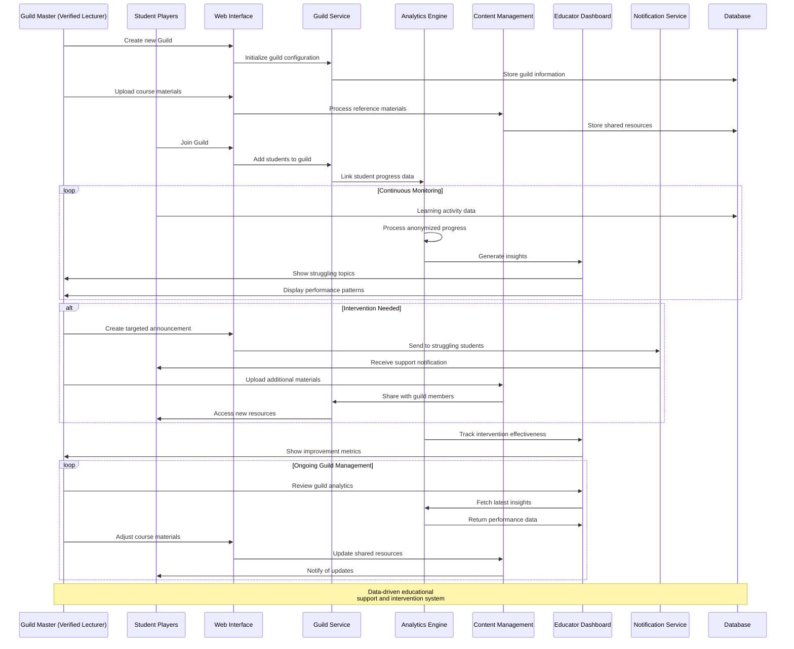

# Guild Management & Educator Dashboard Flow

```mermaid
sequenceDiagram
    participant Educator as Guild Master (Verified Lecturer)
    participant Students as Student Players
    participant UI as Web Interface
    participant Guild as Guild Service
    participant Analytics as Analytics Engine
    participant Content as Content Management
    participant Dashboard as Educator Dashboard
    participant Notify as Notification Service
    participant DB as Database

    Educator->>UI: Create new Guild
    UI->>Guild: Initialize guild configuration
    Guild->>DB: Store guild information
    
    Educator->>UI: Upload course materials
    UI->>Content: Process reference materials
    Content->>DB: Store shared resources
    
    Students->>UI: Join Guild
    UI->>Guild: Add students to guild
    Guild->>Analytics: Link student progress data
    
    loop Continuous Monitoring
        Students->>DB: Learning activity data
        Analytics->>Analytics: Process anonymized progress
        Analytics->>Dashboard: Generate insights
        
        Dashboard->>Educator: Show struggling topics
        Dashboard->>Educator: Display performance patterns
    end
    
    alt Intervention Needed
        Educator->>UI: Create targeted announcement
        UI->>Notify: Send to struggling students
        Notify->>Students: Receive support notification
        
        Educator->>Content: Upload additional materials
        Content->>Guild: Share with guild members
        Guild->>Students: Access new resources
    end
    
    Analytics->>Dashboard: Track intervention effectiveness
    Dashboard->>Educator: Show improvement metrics
    
    loop Ongoing Guild Management
        Educator->>Dashboard: Review guild analytics
        Dashboard->>Analytics: Fetch latest insights
        Analytics->>Dashboard: Return performance data
        
        Educator->>UI: Adjust course materials
        UI->>Content: Update shared resources
        Content->>Students: Notify of updates
    end
    
    Note over Educator,DB: Data-driven educational<br/>support and intervention system
```