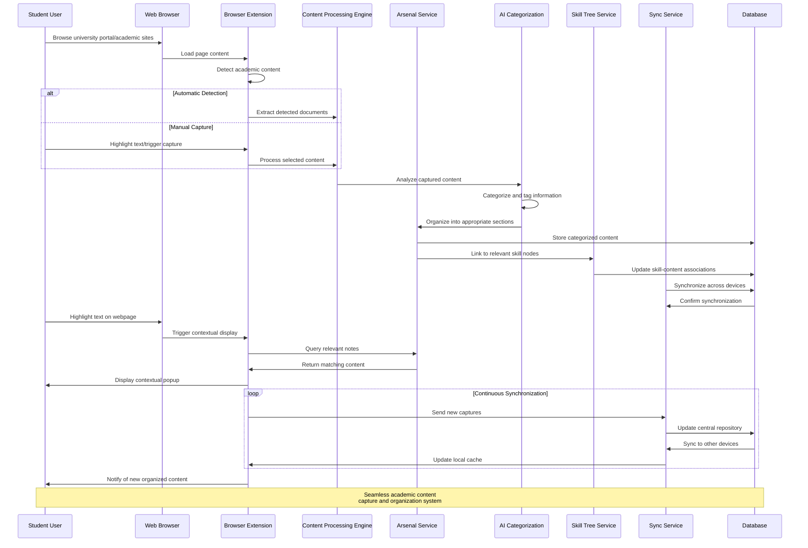

# Browser Extension Integration & Content Capture Flow

```mermaid
sequenceDiagram
    participant U as Student User
    participant Browser as Web Browser
    participant Extension as Browser Extension
    participant Content as Content Processing Engine
    participant Arsenal as Arsenal Service
    participant AI as AI Categorization
    participant STree as Skill Tree Service
    participant Sync as Sync Service
    participant DB as Database

    U->>Browser: Browse university portal/academic sites
    Browser->>Extension: Load page content
    Extension->>Extension: Detect academic content
    
    alt Automatic Detection
        Extension->>Content: Extract detected documents
    else Manual Capture
        U->>Extension: Highlight text/trigger capture
        Extension->>Content: Process selected content
    end
    
    Content->>AI: Analyze captured content
    AI->>AI: Categorize and tag information
    AI->>Arsenal: Organize into appropriate sections
    
    Arsenal->>DB: Store categorized content
    Arsenal->>STree: Link to relevant skill nodes
    STree->>DB: Update skill-content associations
    
    Sync->>DB: Synchronize across devices
    DB->>Sync: Confirm synchronization
    
    U->>Browser: Highlight text on webpage
    Browser->>Extension: Trigger contextual display
    Extension->>Arsenal: Query relevant notes
    Arsenal->>Extension: Return matching content
    Extension->>U: Display contextual popup
    
    loop Continuous Synchronization
        Extension->>Sync: Send new captures
        Sync->>DB: Update central repository
        DB->>Sync: Sync to other devices
        Sync->>Extension: Update local cache
    end
    
    Extension->>U: Notify of new organized content
    
    Note over U,DB: Seamless academic content<br/>capture and organization system
```