# Event Creation and Participating - Sequence Diagram

## Overview
This sequence diagram illustrates the complete flow of event creation by Guild Masters and participation by guild members in code battle competitions. The flow covers event creation, approval workflow, guild registration, and real-time competitive coding battles.

## Actors
- **Guild Master**: Creates and manages competitive events for guilds
- **User (Student)**: Guild members who participate in code battles
- **Web Interface**: Frontend application interface
- **API Gateway**: Central API routing and authentication
- **Code Battle Service**: Manages events, rooms, problems, and judging
- **Social Service**: Handles guild information and member management
- **Database**: Persistent data storage

## Sequence Diagram

```mermaid
sequenceDiagram
    participant GM as Guild Master
    participant U as User (Student)
    participant WI as Web Interface
    participant AG as API Gateway
    participant CBS as Code Battle Service
    participant SS as Social Service
    participant DB as Database

    Note over GM, DB: Event Creation Phase
    
    GM->>WI: Access guild management dashboard
    WI->>AG: Request guild management interface
    AG->>SS: Fetch guild information and permissions
    SS->>DB: Query guild details and member count
    DB-->>SS: Return guild data
    SS-->>AG: Guild information with creation permissions
    AG-->>WI: Guild dashboard with event creation option
    WI-->>GM: Display event creation interface

    GM->>WI: Initiate new code battle event creation
    WI->>AG: Request event creation form
    AG->>CBS: Fetch available problem categories and settings
    CBS->>DB: Query code problem statistics and difficulty levels
    DB-->>CBS: Return problem distribution data
    CBS-->>AG: Available configuration options
    AG-->>WI: Event creation form with options
    WI-->>GM: Display event configuration interface

    GM->>WI: Configure event (difficulty mix, points, timing, rules)
    WI->>AG: Submit event configuration
    AG->>CBS: Create new event with configuration
    CBS->>DB: Store event details and configuration
    CBS->>DB: Randomly select code problems based on difficulty settings
    DB-->>CBS: Return selected problems and event ID
    CBS->>SS: Notify about new event requiring guild registration
    SS->>DB: Store event notification for eligible guilds
    CBS-->>AG: Event created successfully with approval status
    AG-->>WI: Event creation confirmation
    WI-->>GM: Display event details and registration status

    Note over GM, DB: Guild Registration Phase

    GM->>WI: Register guild for participation
    WI->>AG: Submit guild registration request
    AG->>CBS: Process guild registration
    CBS->>SS: Validate guild eligibility and member count
    SS->>DB: Check guild status and active members
    DB-->>SS: Return guild validation data
    SS-->>CBS: Guild eligibility confirmation
    CBS->>DB: Register guild as event participant
    DB-->>CBS: Registration confirmation
    CBS-->>AG: Guild registration successful
    AG-->>WI: Registration confirmation
    WI-->>GM: Display participation confirmation

    Note over GM, DB: Event Participation Phase

    U->>WI: Access upcoming code battle events
    WI->>AG: Request user's available events
    AG->>CBS: Fetch events for user's guild
    CBS->>SS: Get user's guild memberships
    SS->>DB: Query user guild associations
    DB-->>SS: Return guild membership data
    SS-->>CBS: User's eligible guilds
    CBS->>DB: Query registered events for user's guilds
    DB-->>CBS: Return available events
    CBS-->>AG: User's available events list
    AG-->>WI: Events list with participation options
    WI-->>U: Display available code battle events

    U->>WI: Join specific code battle event
    WI->>AG: Request to join event battle room
    AG->>CBS: Create or join battle room for event
    CBS->>DB: Create room entry and associate user
    CBS->>DB: Fetch event problems and test cases
    DB-->>CBS: Return room details and problems
    CBS-->>AG: Room access granted with problem set
    AG-->>WI: Battle room interface with problems
    WI-->>U: Display code battle interface

    Note over GM, DB: Real-time Competition Phase

    loop For each code submission
        U->>WI: Submit code solution for problem
        WI->>AG: Send code submission
        AG->>CBS: Process code submission
        CBS->>DB: Store submission with pending status
        CBS->>CBS: Execute code against test cases (internal judging)
        CBS->>DB: Update submission with results and score
        CBS->>DB: Update individual leaderboard entry
        CBS->>SS: Update guild leaderboard aggregation
        SS->>DB: Store guild total scores
        CBS-->>AG: Submission results and updated rankings
        AG-->>WI: Real-time score updates
        WI-->>U: Display submission feedback and leaderboard
        
        Note over CBS, SS: Broadcast to all participants
        CBS->>WI: Broadcast leaderboard updates to all participants
        WI-->>U: Real-time leaderboard updates
    end

    Note over GM, DB: Event Completion Phase

    CBS->>CBS: Event time expires or completion criteria met
    CBS->>DB: Finalize all submissions and calculate final rankings
    CBS->>DB: Generate individual participant final scores
    CBS->>SS: Calculate final guild leaderboard totals
    SS->>DB: Store final guild rankings and achievements
    CBS->>DB: Update user achievements and guild reputation
    CBS-->>WI: Broadcast final results to all participants
    WI-->>U: Display final rankings and achievements
    WI-->>GM: Display event completion summary and analytics

    Note over GM, DB: Post-Event Analytics

    GM->>WI: Access event analytics dashboard
    WI->>AG: Request event performance data
    AG->>CBS: Fetch detailed event analytics
    CBS->>DB: Query submission patterns, performance metrics
    CBS->>SS: Get guild participation and engagement data
    SS->>DB: Query guild member activity during event
    DB-->>SS: Return participation analytics
    SS-->>CBS: Guild engagement metrics
    DB-->>CBS: Individual and aggregate performance data
    CBS-->>AG: Comprehensive event analytics
    AG-->>WI: Analytics dashboard data
    WI-->>GM: Display event insights and recommendations
```

## Key Features Highlighted

### Event Creation Workflow
- Guild Masters can configure events with specific difficulty distributions
- System randomly selects problems based on configuration
- Automatic guild registration and eligibility validation

### Real-time Competition
- Live code submission and judging
- Real-time leaderboard updates for individuals and guilds
- Secure code execution with comprehensive test case validation

### Cross-Service Integration
- Code Battle Service manages technical aspects (problems, judging, scoring)
- Social Service handles guild information and member management
- Seamless data flow between services for comprehensive functionality

### Analytics and Insights
- Post-event performance analysis
- Guild engagement metrics
- Individual and collective achievement tracking

## Technical Considerations

### Performance
- Real-time updates use efficient broadcasting mechanisms
- Code execution is sandboxed and optimized for concurrent submissions
- Database queries are optimized for leaderboard calculations

### Security
- All code submissions are executed in secure, isolated environments
- Guild permissions are validated at multiple checkpoints
- User authentication is maintained throughout the competition

### Scalability
- System supports multiple concurrent events
- Battle rooms can accommodate varying numbers of participants
- Leaderboard calculations are optimized for large-scale competitions