# Flow 6: Event Creation and Participating - Sequence Diagram

## Overview
This sequence diagram illustrates the complete workflow for "Flow 6: Event Management & Code Battle Competition" showing the interaction between Guild Master A (event creator), Admin (event approver), Guild Master B (participating guild leader), Users (Students), and the system services for creating, approving, registering, and executing code battle competitions.

## Actors
- **Guild Master A**: Creates and configures competitive events
- **User (Student)**: Guild members who participate in code battles
- **Guild Master B**: Leaders of guilds that join events
- **Admin**: Approves event creation requests
- **Web Interface**: User interaction layer
- **API Gateway**: Request routing and authentication
- **Code Battle Service**: Manages events, rooms, code problems, and judging
- **Social Service**: Manages guild information and membership
- **Database**: Data persistence layer

## Sequence Diagram

```mermaid
sequenceDiagram
    participant GMA as Guild Master A
    participant Admin as Admin
    participant GMB as Guild Master B
    participant User as User (Student)
    participant Web as Web Interface
    participant API as API Gateway
    participant CBS as Code Battle Service
    participant SS as Social Service
    participant DB as Database

    Note over GMA, DB: Phase 1: Event Creation & Approval

    GMA->>Web: Access event creation interface
    Web->>API: Request event creation form
    API->>CBS: Get event configuration options
    CBS->>DB: Retrieve code problems and difficulty levels
    DB-->>CBS: Return available problems
    CBS-->>API: Return configuration options
    API-->>Web: Display event creation form
    Web-->>GMA: Show event configuration options

    GMA->>Web: Configure event (difficulty distribution, points, timing)
    Web->>API: Submit event creation request
    API->>CBS: Create event with configuration
    CBS->>DB: Store event data
    DB-->>CBS: Confirm event stored
    CBS->>CBS: Generate approval notification
    CBS-->>API: Event creation pending approval
    API-->>Web: Display pending approval status
    Web-->>GMA: Show event awaiting approval

    CBS->>Admin: Notify pending event approval
    Admin->>Web: Review event details
    Web->>API: Request event details
    API->>CBS: Get event information
    CBS->>DB: Retrieve event data
    DB-->>CBS: Return event details
    CBS-->>API: Return event information
    API-->>Web: Display event details
    Web-->>Admin: Show event for approval

    Admin->>Web: Approve event
    Web->>API: Submit approval decision
    API->>CBS: Approve event
    CBS->>DB: Update event status to approved
    DB-->>CBS: Confirm status updated
    CBS->>CBS: Randomly select code problems
    CBS->>DB: Store selected problems for event
    DB-->>CBS: Confirm problems stored
    CBS-->>API: Event approved and ready
    API-->>Web: Display approval confirmation
    Web-->>Admin: Show event approved

    Note over GMA, DB: Phase 2: Event Setup & Guild Registration

    CBS->>SS: Broadcast event announcement to guilds
    SS->>DB: Retrieve eligible guild list
    DB-->>SS: Return guild information
    SS-->>CBS: Confirm announcement sent

    GMB->>Web: View available events
    Web->>API: Request available events
    API->>CBS: Get approved events
    CBS->>DB: Retrieve approved events
    DB-->>CBS: Return event list
    CBS-->>API: Return available events
    API-->>Web: Display events list
    Web-->>GMB: Show available events

    GMB->>Web: Register guild for event
    Web->>API: Submit guild registration
    API->>CBS: Register guild for event
    CBS->>SS: Validate guild eligibility
    SS->>DB: Check guild status and membership
    DB-->>SS: Return guild validation data
    SS-->>CBS: Confirm guild eligible
    CBS->>DB: Create event-guild participation record
    DB-->>CBS: Confirm registration stored
    CBS-->>API: Guild registration confirmed
    API-->>Web: Display registration success
    Web-->>GMB: Show registration confirmed

    Note over GMA, DB: Phase 3: Competition Execution

    CBS->>CBS: Initialize battle rooms for event
    CBS->>DB: Create room records for guilds
    DB-->>CBS: Confirm rooms created
    CBS->>SS: Notify guild members of event start
    SS->>DB: Retrieve guild member lists
    DB-->>SS: Return member information
    SS-->>CBS: Members notified

    User->>Web: Join competition room
    Web->>API: Request room access
    API->>CBS: Validate user participation
    CBS->>SS: Verify user guild membership
    SS->>DB: Check user guild status
    DB-->>SS: Return membership status
    SS-->>CBS: Confirm user eligible
    CBS->>DB: Add user to room
    DB-->>CBS: Confirm user added
    CBS-->>API: Room access granted
    API-->>Web: Display competition interface
    Web-->>User: Show code problems

    User->>Web: Submit code solution
    Web->>API: Send solution for evaluation
    API->>CBS: Process code submission
    CBS->>CBS: Execute code against test cases
    CBS->>DB: Store submission results
    DB-->>CBS: Confirm results stored
    CBS->>CBS: Update leaderboards
    CBS->>DB: Update individual and guild scores
    DB-->>CBS: Confirm scores updated
    CBS-->>API: Return submission results
    API-->>Web: Display results and rankings
    Web-->>User: Show submission feedback

    Note over GMA, DB: Phase 4: Results & Analytics

    CBS->>CBS: Calculate final rankings
    CBS->>DB: Retrieve all submission data
    DB-->>CBS: Return competition results
    CBS->>SS: Update guild reputation scores
    SS->>DB: Update guild statistics
    DB-->>SS: Confirm updates applied
    SS-->>CBS: Guild updates confirmed

    CBS->>DB: Store final leaderboards
    DB-->>CBS: Confirm leaderboards stored
    CBS->>SS: Publish results to guild dashboards
    SS->>DB: Update guild achievement records
    DB-->>SS: Confirm achievements updated
    SS-->>CBS: Results published successfully

    CBS-->>API: Competition completed
    API-->>Web: Display final results
    Web-->>User: Show final rankings and achievements
    Web-->>GMB: Show guild performance summary
    Web-->>GMA: Show event completion report
```

## Key Features Highlighted

1. **Admin Approval Workflow**: Clear approval process where Admin must review and approve events before they become available
2. **Service Separation**: Distinct responsibilities between Code Battle Service (event management, judging) and Social Service (guild management)
3. **Guild Information Integration**: Code Battle Service queries Social Service for guild eligibility, membership, and updates
4. **Real-time Competition**: Live code submission, evaluation, and leaderboard updates during competition
5. **Comprehensive Results**: Final rankings update both individual achievements and guild reputation through service coordination

## Technical Considerations

- **Service Communication**: Code Battle Service and Social Service communicate for guild data validation and updates
- **Real-time Updates**: Live leaderboard updates during competition execution
- **Data Consistency**: Cross-service data synchronization for guild information and achievements
- **Scalability**: Room-based architecture supports multiple concurrent competitions
- **Security**: API Gateway handles authentication and request routing for all user interactions