# Flow 6: Event Creation and Participating - Sequence Diagram

## Overview
This sequence diagram illustrates the complete workflow for code battle event creation and participation, showcasing how Guild Master A creates events that require admin approval, and how Guild Master B and other guilds can register and participate in approved events.

## Actors
- **Guild Master A**: The guild leader who initiates event creation
- **Admin**: System administrator who approves event creation requests
- **Guild Master B**: Representative of participating guilds
- **User (Student)**: Guild members who participate in code battles
- **Web Interface**: Frontend application interface
- **API Gateway**: Central API routing and authentication layer
- **Code Battle Service**: Core service managing events, rooms, and judging
- **Database**: Data persistence layer

## Sequence Diagram

```mermaid
sequenceDiagram
    participant GMA as Guild Master A
    participant Admin as Admin
    participant GMB as Guild Master B
    participant User as User (Student)
    participant Web as Web Interface
    participant API as API Gateway
    participant CBS as Code Battle Service
    participant DB as Database

    Note over GMA, DB: Event Creation & Approval Phase
    
    GMA->>Web: Access event creation interface
    Web->>API: Request event creation form
    API->>CBS: Fetch event configuration options
    CBS->>DB: Query available code problems and settings
    DB-->>CBS: Return problem categories and configuration options
    CBS-->>API: Return event creation form data
    API-->>Web: Provide form with options
    Web-->>GMA: Display event creation form
    
    GMA->>Web: Configure event (difficulty distribution, points, timing)
    Web->>API: Submit event creation request
    API->>CBS: Process event creation request
    CBS->>DB: Store pending event with approval status
    DB-->>CBS: Confirm event stored as pending
    CBS-->>API: Event creation request submitted
    API-->>Web: Confirm submission
    Web-->>GMA: Display submission confirmation
    
    CBS->>Admin: Send event approval notification
    Admin->>Web: Review pending event request
    Web->>API: Request event details for approval
    API->>CBS: Fetch pending event details
    CBS->>DB: Query event configuration and requirements
    DB-->>CBS: Return event details
    CBS-->>API: Provide event details
    API-->>Web: Display event for review
    Web-->>Admin: Show event details and approval options
    
    Admin->>Web: Approve event creation
    Web->>API: Submit event approval
    API->>CBS: Process event approval
    CBS->>DB: Update event status to approved and finalize setup
    CBS->>DB: Randomly select code problems based on configuration
    DB-->>CBS: Confirm event approved and problems assigned
    CBS-->>API: Event approved and ready
    API-->>Web: Confirm approval
    Web-->>Admin: Display approval confirmation
    
    Note over GMA, DB: Event Setup & Guild Registration Phase
    
    CBS->>Web: Broadcast approved event announcement
    Web->>GMB: Notify of available event
    Web->>User: Display event in guild dashboard
    
    GMB->>Web: View available events
    Web->>API: Request event details
    API->>CBS: Fetch event information
    CBS->>DB: Query event details and requirements
    DB-->>CBS: Return event information
    CBS-->>API: Provide event details
    API-->>Web: Display event information
    Web-->>GMB: Show event details and registration option
    
    GMB->>Web: Register guild for event
    Web->>API: Submit guild registration
    API->>CBS: Process guild registration
    CBS->>DB: Verify guild eligibility and store registration
    DB-->>CBS: Confirm guild registered
    CBS-->>API: Registration successful
    API-->>Web: Confirm registration
    Web-->>GMB: Display registration confirmation
    
    Note over GMA, DB: Competition Execution Phase
    
    CBS->>DB: Initialize event battle rooms
    DB-->>CBS: Battle rooms created
    CBS->>Web: Notify event start to all participants
    Web->>User: Display event start notification
    
    User->>Web: Join battle room
    Web->>API: Request battle room access
    API->>CBS: Authenticate and grant room access
    CBS->>DB: Log participant entry
    CBS-->>API: Room access granted
    API-->>Web: Provide battle interface
    Web-->>User: Display code battle interface with problems
    
    loop For each code submission
        User->>Web: Submit code solution
        Web->>API: Send code submission
        API->>CBS: Process code submission
        CBS->>DB: Store submission and run automated tests
        DB-->>CBS: Return test results and scoring
        CBS->>DB: Update participant and guild leaderboards
        CBS-->>API: Submission processed with results
        API-->>Web: Provide submission feedback
        Web-->>User: Display results and updated leaderboard
        
        Note over CBS, Web: Real-time updates to all participants
        CBS->>Web: Broadcast leaderboard updates
        Web-->>User: Real-time leaderboard updates
        Web-->>GMB: Guild performance updates
        Web-->>GMA: Event progress updates
    end
    
    Note over GMA, DB: Results & Analytics Phase
    
    CBS->>DB: Calculate final rankings and statistics
    DB-->>CBS: Return comprehensive results
    CBS->>Web: Publish final results to all participants
    Web->>GMA: Display event results and analytics
    Web->>GMB: Show guild performance and rankings
    Web->>User: Present individual achievements and scores
    
    Note over GMA, DB: Post-Event Analytics
    
    GMA->>Web: Access event analytics dashboard
    Web->>API: Request event performance data
    API->>CBS: Fetch detailed event analytics
    CBS->>DB: Query submission patterns and performance metrics
    DB-->>CBS: Return analytics data
    CBS-->>API: Comprehensive event analytics
    API-->>Web: Analytics dashboard data
    Web-->>GMA: Display event insights and recommendations
```

## Key Features Highlighted

### Event Creation Workflow
- Guild Masters can configure events with specific difficulty distributions
- System randomly selects problems based on configuration
- Automatic guild registration and eligibility validation

### Real-time Competition
- Live code submission and judging
- Real-time leaderboard updates for individuals and guilds
- Secure code execution with comprehensive test case validation

### Cross-Service Integration
- Code Battle Service manages technical aspects (problems, judging, scoring)
- Social Service handles guild information and member management
- Seamless data flow between services for comprehensive functionality

### Analytics and Insights
- Post-event performance analysis
- Guild engagement metrics
- Individual and collective achievement tracking

## Technical Considerations

### Performance
- Real-time updates use efficient broadcasting mechanisms
- Code execution is sandboxed and optimized for concurrent submissions
- Database queries are optimized for leaderboard calculations

### Security
- All code submissions are executed in secure, isolated environments
- Guild permissions are validated at multiple checkpoints
- User authentication is maintained throughout the competition

### Scalability
- System supports multiple concurrent events
- Battle rooms can accommodate varying numbers of participants
- Leaderboard calculations are optimized for large-scale competitions