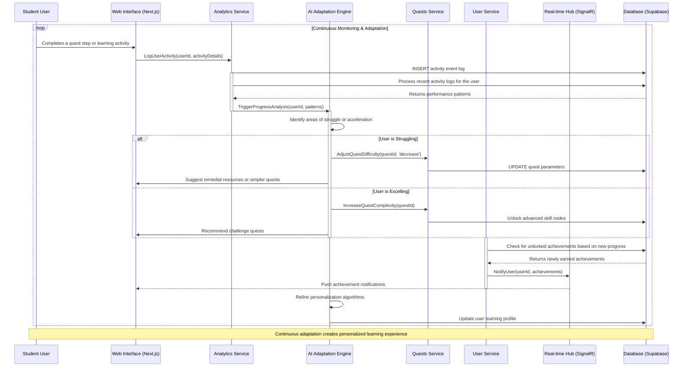

# Real-time Progress Tracking & Adaptive Learning Flow

```mermaid
sequenceDiagram
    participant U as Student User
    participant UI as Web Interface (Next.js)
    participant AnalyticsService as Analytics Service
    participant AI_Engine as AI Adaptation Engine
    participant QuestsService as Quests Service
    participant UserService as User Service
    participant RealtimeHub as Real-time Hub (SignalR)
    participant Database as Database (Supabase)

    loop Continuous Monitoring & Adaptation
        %% Step 1: User interacts with the platform %%
        U->>UI: Completes a quest step or learning activity
        UI->>AnalyticsService: LogUserActivity(userId, activityDetails)
        AnalyticsService->>Database: INSERT activity event log

        %% Step 2: Analytics are processed (can be real-time or batched) %%
        activate AnalyticsService
        AnalyticsService->>Database: Process recent activity logs for the user
        Database-->>AnalyticsService: Returns performance patterns
        
        %% Step 3: The AI Engine evaluates the user's progress %%
        AnalyticsService->>AI_Engine: TriggerProgressAnalysis(userId, patterns)
        deactivate AnalyticsService
        
        activate AI_Engine
        AI_Engine->>AI_Engine: Identify areas of struggle or acceleration
        
        alt User is Struggling
            AI_Engine->>QuestsService: AdjustQuestDifficulty(questId, 'decrease')
            QuestsService->>Database: UPDATE quest parameters
            AI_Engine->>UI: Suggest remedial resources or simpler quests
        else User is Excelling
            AI_Engine->>QuestsService: IncreaseQuestComplexity(questId)
            QuestsService->>Database: Unlock advanced skill nodes
            AI_Engine->>UI: Recommend challenge quests
        end
        deactivate AI_Engine

        %% Step 4: Check for milestone achievements %%
        activate UserService
        UserService->>Database: Check for unlocked achievements based on new progress
        Database-->>UserService: Returns newly earned achievements
        UserService->>RealtimeHub: NotifyUser(userId, achievements)
        RealtimeHub-->>UI: Push achievement notifications
        deactivate UserService
        
        AI_Engine->>AI_Engine: Refine personalization algorithms
        AI_Engine->>Database: Update user learning profile
    end
    
    Note over U,Database: Continuous adaptation creates personalized learning experience
```